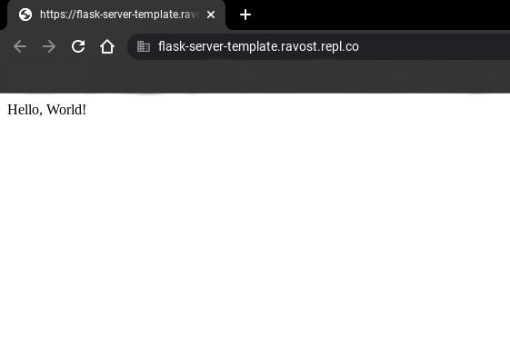
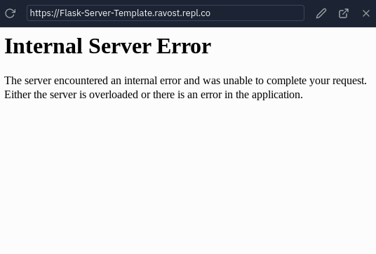

## Python Flask Server Template
------

Flask is an application builder. It is very common in [Python](https://python.org) but can also be used in [Nodejs](https://nodejs.org)

A simple server that would print `hello world`
Would be something like this:
```py
from flask import Flask
app = Flask('app')

@app.route('/')
def hello_world():
  return 'Hello, World!'

app.run(host='0.0.0.0', port=8080)
```
This simple server just returns 'Hello world'


But maybe you want to render html documents in flask. Well you can do that!

just add `render_template` after `... import Flask`
The next step is **VITAL:** you need to add a folder named `templates` without it this could happen:

It pretty much means that it cant find a file named `[filename].html` in your `templates` folder.
So after you created your templates folder put your html document in it. You can write what you want in it.

Then in your python code instead of returning text just `return render_template('index.html')` The templates file path extension is not needed.

If you want you could also return html code in your `return` statement
```py
return '<h1>Hello world</h1>'
```

To learn more, checkout the [official guide](https://flask.palletsprojects.com/en/2.0.x/quickstart/).